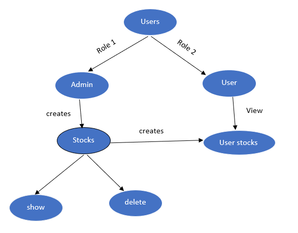

# README

# Stock Portfolio

## Running

```
 bundle install
```

```
rails db:migrate
```

# Usage

Add admin role to user in your rails console 

```ruby
  @user = User.find(id)
  @user.admin = true
  @user.save(validate: false)
```
# Please follow the following steps before you signup or try to do password reset (email delivery)

```
"In  config\environments\development.rb please enter your valid gmail address and password in
config.action_mailer.smtp_settings
to enable email delivery else you will get error and you can not signup or do "forgot password"
```

"Steps"
* create or use your existing gmail account and enable less secure apps in settings else you won't be able to do email delivery because of gmail's security features.


# Story board for the project


# Associations chart


